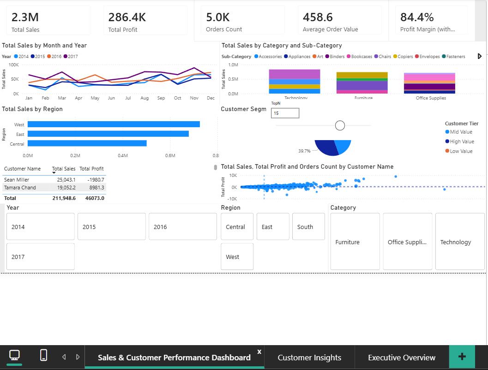
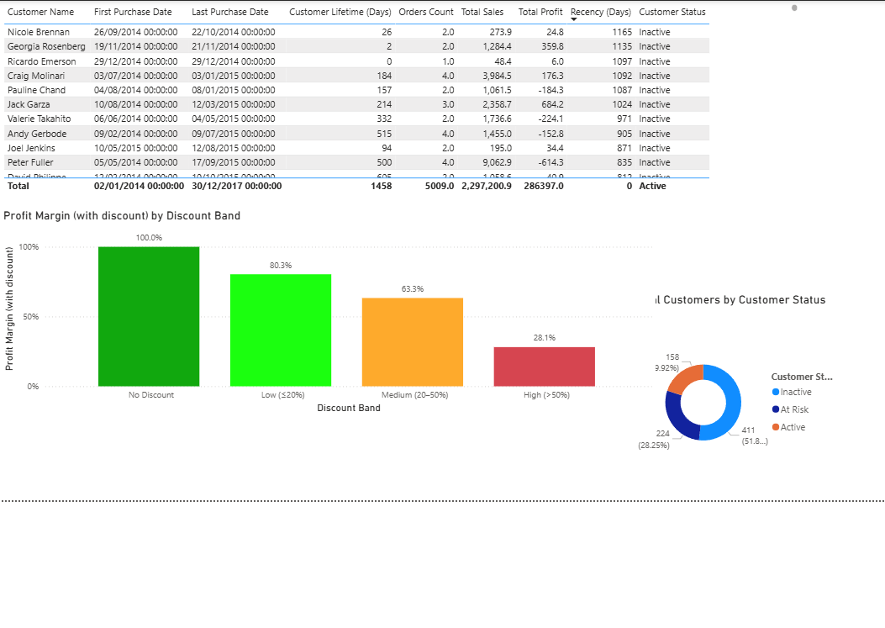

# 📊 Strategic Customer Retention & Revenue Optimization (Enhanced Power BI)

## 📌 Project Overview
This project delivers an end-to-end business intelligence solution analysing sales performance, customer behaviour, and profitability using Power BI.

The dashboard focuses on identifying key drivers of revenue, margin pressure, and customer retention risk, providing actionable insights for business decision-making.

---

## 🎯 Key Features

- 📈 Sales & Profitability Analysis
- 👥 Customer Lifetime & Retention Analysis
- 💰 Discount Impact on Profit Margin
- 🔝 Dynamic Top-N Customer Analysis
- 🧠 Executive Summary for decision-making
- 🏗️ Star Schema Data Model (Fact & Dimension tables)

---

## 📊 Dashboard Preview

### 🔹 Executive Overview

### 🔹 Sales & Performance Dashboard

### 🔹 Customer Insights

---

## 🧠 Business Insights

- Strong revenue performance (£2.3M) but moderate margin (12.5%)
- High discounting reduces margin from 100% to 28.1%
- 51.8% of customers are inactive, indicating retention risk
- Revenue is concentrated in top customers and key regions

---

## 🚀 Business Recommendations

- Optimise pricing and discount strategies to improve profitability
- Implement customer retention and reactivation programmes
- Expand high-performing regional strategies
- Reduce reliance on high-discount transactions

---

## 🏗️ Data Model

- Fact Table: Sales
- Dimension Tables: Customer, Product, Date, Geography
- Relationships: Star Schema (Many-to-one)

---

## 🛠️ Tools & Skills

- Power BI (DAX, Data Modelling)
- Power Query (ETL & Data Cleaning)
- Data Visualisation & Dashboard Design
- Business Analysis & Insight Generation

---

## 📂 Dataset

- Sample Superstore Dataset

---

## 📌 Author

Bo Kwok
